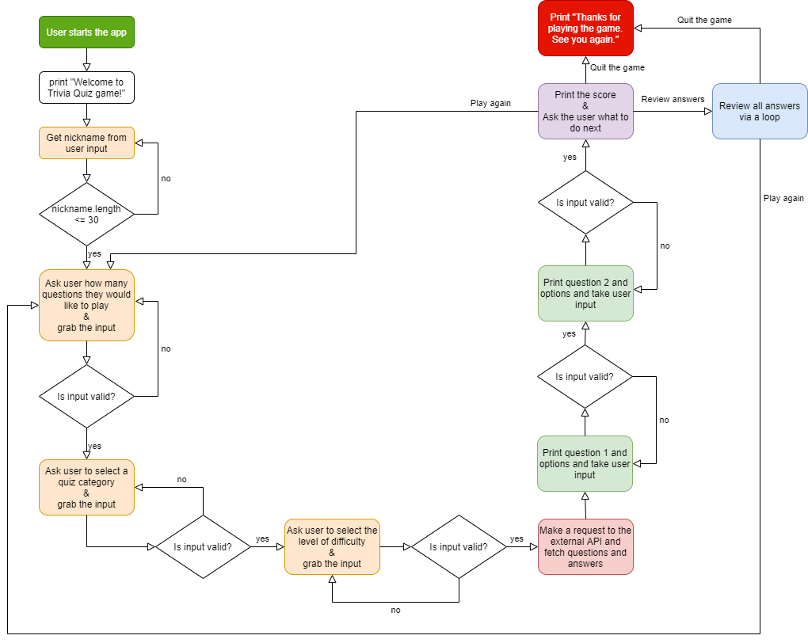

# Trivia Quiz App

This is a ruby terminal application that uses an external trivia quiz API (https://opentdb.com/api_config.php) to create fun trivia quiz games for anyone.

The user will be able to choose the number of questions they would like to answer, category (e.g. general knowledge, sports, and many more), and the level of difficulty. The application will create a trivia quiz game tailored to the user's preferences.

The link to my source control repository is: https://github.com/jkim333/T1A3-Terminal-Application

<br>

# Software Development Plan

## Purpose and Scope

This application will create trivia quiz game for the users. The purpose of this application is to provide entertainment by engaging people to play the trivia quiz game.

The user will be able to choose the number of questions they would like to answer, category (e.g. general knowledge, sports, and many more), and the level of difficulty. Depending on the choices they make, the application will create a game tailored to the user's preferences.

The application will provide entertainment, and serve as a tool for users to increase and test their knowledge. It could also be used by teachers as a tool to teach students knowledge from history, science and many other topics that are offered by the application. Students will be able to learn new knowledge while having fun playing the game.

The target audience of this application could be a range of people including teachers, adults, kids, senior citizens and anyone that wants to have fun and test and improve their knowledge. The application comes with the flexibility for the user to choose the level of difficulty, the quiz category, and the number of questions. Therefore, this application will target a wide range of audience.

When the game is launched, the user will be prompted to choose the nickname. After this, the user will be prompted with the following questions: the number of questions they would like to answer, category (e.g. general knowledge, sports), and the level of difficulty. With these answers, the application will provide questions tailored to the user's preferences. After the user completes all questions, the application will present the score to show how well the user performed the quiz. Lastly, the user will have an opportunity to review their answers and compare their answers to the correct answers.

<br>

## List of features

1. **Choose nickname.** When the user runs the application, the user will first be prompted to enter their nickname for the game. The nickname will need to be 30 characters or less. Otherwise, the application will warn the user and will ask the user to enter their nickname again.

2. **Choose questions.** After the user sets their nickname, the user will then be prompted with the following questions: the number of questions they would like to answer, category (e.g. general knowledge, sports, and many more), and the level of difficulty. With these answers, the application will send a tailored request to the external API. The application will receive a response from the API which will include the questions and answers. The questions and answers will then be stored within the variables before allowing the game to begin.

3. **Show progress.** Each time a user answers a question, the application will notify the user on their progress. For example, after answering two questions out of ten questions, the application will print "Question 2 of 10: ...".

4. **Show score.** After the user completes all questions, the application will then present the score, showing how well the user performed at answering the questions. The application will also show a tailored reaction based on the score. If the user scores 75% or above, the application will print "Amazing! You are a genius!". If the user scores from 50% to 75%, the application will print "Well done. You did a good job.". If the user scores less than 50%, the application will print "Good effort. Try again.".

5. **Determine next move.** After the application presents the score, the application will present a range of options for the user to choose from. The application will ask the user if they want to review the answers, play again or terminate the game.

<br>

## User interaction and experience

The application will ask the user the following questions: their nickname, the number of questions they would like to play, the quiz category, and the level of difficulty. Error handling is performed for all of these questions. For example, if the user enters in a nickname that is more than 30 characters in length, the application will give a warning to the user and ask the user to enter a nickname that is of correct length. The application will not proceed to the next stage unless a correct input is obtained from the user. Based on the information that the user provides, the application will then make a request to the external trivia quiz API (https://opentdb.com/api_config.php) to prepare the questions tailored for the user.

After the questions are downloaded from the external API, the application will then present each question to the user and ask the user to enter in the answer. Again, error handling is applied here to make sure that the user's input is valid. A thorough error handling process is applied whenever the application accepts any sort of input from the user. The application keeps a record of all the inputs that the user provides to later calculate the overall score for the game.

After presenting all of the questions to the user, the application notifies the user of their score with a tailored reaction based on their score. They will be provided with three options to choose from: 1. review all answers, 2. play again, and 3. quit the game. If the user chooses the review all answers, the application will take the user through all of the questions one by one and present the user's answer against the correct answer. If the user chooses to play again, the application will repeat the application. Lastly, the option to quit the game will terminate the application.

By launching the ruby application with -h command line argument, the application provides a brief introduction to the game. Users can find out how to interact with each feature of the game.

<br>

## Control flow diagram

The diagram below describes the control flow of this application.



<br>

## Implementation plan

The table below summarises the tasks required for each feature. [Trello](https://trello.com/en) was used as a project management platform to track this implementation plan.

The link to the Trello dashboard used for this project is: https://trello.com/b/dGZeGS0L/t1a3

The Trello images below show the progress of the project in a chronological order.

| Feature             | Task                                                                                                                                                             |
| ------------------- | ---------------------------------------------------------------------------------------------------------------------------------------------------------------- |
| Choose nickname     | Create initial user prompt asking a user to determine their nickname.                                                                                            |
| Choose questions    | Research how to access web API using ruby.                                                                                                                       |
|                     | Create a user prompt asking user to determine the number of questions, category, and the level of difficulty.                                                    |
|                     | Create a method making an API request to https://opentdb.com/api_config.php                                                                                      |
| Show progress       | Create a method that print the question and choices, and prompt user to submit an answer.                                                                        |
| Show score          | Create a method that shows the score the user achieved after completing the quiz. The method should show a tailored reaction based on the score.                 |
| Determine next move | Create a method that prompts the user if they want to see the correct answers. This method will only be invoked after the user finished answering all questions. |


<br>

## Help documentation

Please follow the steps below to install and run the application.

1. Install [Ruby](https://www.ruby-lang.org/en/documentation/installation/) on your system.

2. Install [git](https://git-scm.com/downloads) on your system.

3. Clone this reponsitory to your computer and change directory into the project folder.

```bash
git clone git@github.com:jkim333/T1A3-Terminal-Application.git
cd T1A3-Terminal-Application
```

4. Install Ruby gem bundler and gem dependencies.

```bash
gem install bundler
bundle install
```

5. Run the application.

```bash
ruby main.rb
```

<br>

The game instruction can be found by running the line below.

```bash
ruby main.rb -h
```

<br>

# Unit Test

Using a Ruby gem called [RSpec](https://rspec.info/), a total of 12 unit tests were developed and used to check that the application is running as expected. Please have a look at the source code of the application to view these tests. The table below provides a detailed summary of these tests.

| Number | Feature                              | Test                                                            | Expectation  | Actual       | Result |
| ------ | ------------------------------------ | --------------------------------------------------------------- | ------------ | ------------ | ------ |
| 1      | Choose nickname                      | should return nickname length 30 characters or less             | "nickname"   | "nickname"   | pass   |
| 2      | Choose nickname                      | should raise error when nickname length more than 30 characters | RuntimeError | RuntimeError | pass   |
| 3      | Choose nickname                      | should raise error when nickname length equals 0                | RuntimeError | RuntimeError | pass   |
| 4      | Choose questions (get_num_questions) | should return 5 when user input is 'a'                          | 5            | 5            | pass   |
| 5      | Choose questions (get_num_questions) | should return 10 when user input is 'b'                         | 10           | 10           | pass   |
| 6      | Choose questions (get_num_questions) | should raise error when user input is 'd'                       | RuntimeError | RuntimeError | pass   |
| 7      | Choose questions (get_category)      | should return 9 when user input is 'a'                          | 9            | 9            | pass   |
| 8      | Choose questions (get_category)      | should return 23 when user input is 'b'                         | 23           | 23           | pass   |
| 9      | Choose questions (get_category)      | should raise error when user input is 'g'                       | RuntimeError | RuntimeError | pass   |
| 10     | Choose questions (get_difficulty)    | should return 'easy' when user input is 'a'                     | "easy"       | "easy"       | pass   |
| 11     | Choose questions (get_difficulty)    | should return 'hard' when user input is 'c'                     | "hard"       | "hard"       | pass   |
| 12     | Choose questions (get_difficulty)    | should raise error when user input is 'd'                       | RuntimeError | RuntimeError | pass   |
